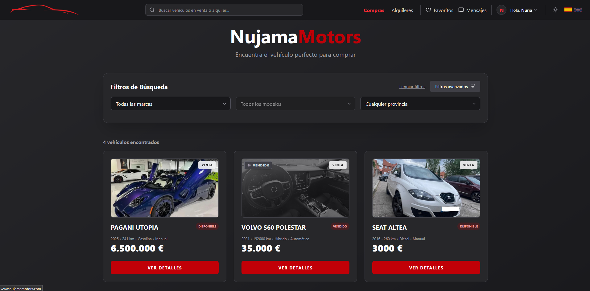

# 🚗 Plataforma de Compraventa y Alquiler de Vehículos (TFG)

<p align="center">
  
</p>

## 📖 Descripción del Proyecto

Esta aplicación web es una plataforma integral (*Marketplace*) diseñada para la compra, venta y alquiler de vehículos.

Desarrollada como Trabajo de Fin de Grado (TFG) para el ciclo de Desarrollo de Aplicaciones Web (2DAW), la plataforma conecta a usuarios interesados en adquirir o alquilar vehículos con vendedores y propietarios, ofreciendo un entorno moderno, seguro, intuitivo y multilingüe.

---

## ✨ Características Principales

- 🚘 **Gestión de anuncios**  
  Creación, edición y eliminación de anuncios de venta y alquiler de vehículos.

- ☁️ **Almacenamiento en la nube**  
  Integración con la **API de Google Drive** para el almacenamiento optimizado de imágenes.

- 💬 **Chat en tiempo real**  
  Sistema de mensajería integrado entre compradores y vendedores.

- 🌍 **Internacionalización (i18n)**  
  Soporte multiidioma para mejorar la accesibilidad de la plataforma.

- 🛡️ **Panel de administración**  
  Dashboard completo para moderación de usuarios y gestión de contenido.

- ⭐ **Sistema de favoritos y reseñas**  
  Los usuarios pueden guardar vehículos favoritos y valorar experiencias.

- 📱 **Diseño responsive**  
  Interfaz moderna y adaptable a móviles, tablets y escritorio.

---

## 🛠️ Tecnologías Utilizadas

### 🎨 Frontend

- **React** + **TypeScript**
- **Vite**
- **Tailwind CSS**
- **React Router**
- **i18next**

### ⚙️ Backend

- **Laravel / PHP**
- **API RESTful**
- **PostgreSQL / MySQL**
- **Google Drive API**

---

## 🚀 Instalación y Despliegue Local

Para ejecutar este proyecto localmente necesitarás:

- Node.js
- PHP
- Composer
- PostgreSQL o MySQL

---

### 1️⃣ Configuración del Backend (Laravel)

Navega a la carpeta del backend e instala las dependencias:

```bash
cd backend
composer install
```

Copia el archivo de entorno y genera la clave de la aplicación:

```bash
cp .env.example .env
php artisan key:generate
```

Configura las credenciales de la base de datos y la API de Google Drive en el archivo `.env`.

Ejecuta las migraciones e inicia el servidor:

```bash
php artisan migrate --seed
php artisan storage:link
php artisan serve
```

---

### 2️⃣ Configuración del Frontend (React)

Abre una nueva terminal y ejecuta:

```bash
cd frontend
pnpm install
```

Inicia el servidor de desarrollo:

```bash
pnpm run dev
```

---

## 📂 Estructura del Proyecto

```bash
/backend
 ├── app
 ├── routes
 ├── database
 └── ...

/frontend
 ├── src
 ├── components
 ├── pages
 ├── services
 └── ...
```

---

## 🌟 Funcionalidades Destacadas

- Sistema de autenticación y autorización
- Gestión avanzada de anuncios
- Chat entre usuarios
- Favoritos y reseñas
- Panel de administración
- Integración con almacenamiento cloud
- Soporte multiidioma
- Diseño responsive y moderno

---

## 👩‍💻 Autores

Desarrollado por **Javier Pinel, Marco Martínez y Nuria Pinés**  
💼 Juniors Full Stack Developer

---

## 📄 Licencia

Proyecto desarrollado con fines académicos como Trabajo de Fin de Grado (TFG).
